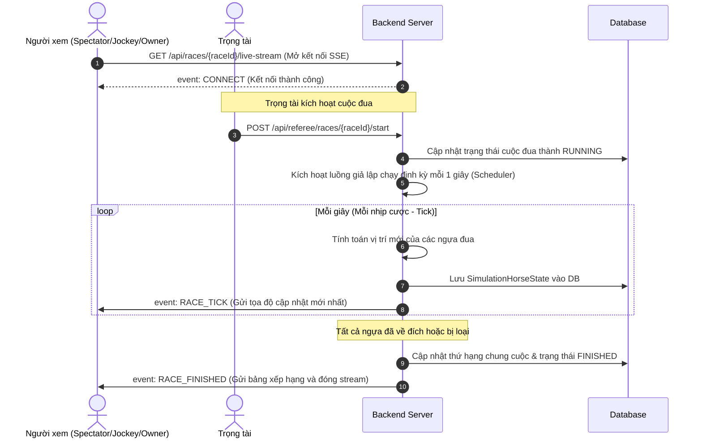

# Real-Time Live Race Streaming API Documentation

Tài liệu này đặc tả luồng API và định dạng dữ liệu cho tính năng phát trực tiếp (Live Stream) mô phỏng cuộc đua thời gian thực giữa Backend (Spring Boot) và Client thông qua **Server-Sent Events (SSE)**.

---

## 1. Kiến trúc & Luồng nghiệp vụ (Workflow)



---

## 2. Đặc tả các Endpoints

### 2.1. Đăng ký nhận luồng trực tiếp (Live Stream Connection)

Cổng kết nối lắng nghe dữ liệu cập nhật thời gian thực của cuộc đua.

* **Endpoint**: `/api/races/{id}/live-stream`
* **Method**: `GET`
* **Content-Type**: `text/event-stream`
* **Xác thực**: Không yêu cầu (Public endpoint để dễ dàng kết nối qua các trình duyệt/EventSource).

#### Các sự kiện (Events) được phát ra:

#### A. Sự kiện kết nối thành công (`CONNECT`)
*Phát ra ngay sau khi Client thiết lập kết nối thành công.*
```text
event: CONNECT
data: Subscribed to live race 1
```

#### B. Sự kiện cập nhật nhịp đua (`RACE_TICK`)
*Phát ra định kỳ mỗi 1 giây trong suốt quá trình cuộc đua diễn ra.*
```text
event: RACE_TICK
data: {
  "raceId": 1,
  "currentTick": 1,
  "status": "RUNNING",
  "horses": [
    {
      "horseId": 1,
      "horseName": "Horse 1",
      "currentPosition": 15.42,
      "speed": 15.42,
      "stamina": 98.0,
      "status": "RACING"
    },
    {
      "horseId": 2,
      "horseName": "Horse 2",
      "currentPosition": 14.85,
      "speed": 14.85,
      "stamina": 98.0,
      "status": "RACING"
    }
  ]
}
```

#### C. Sự kiện hoàn tất cuộc đua (`RACE_FINISHED`)
*Phát ra một lần duy nhất khi tất cả ngựa đua đã cán đích hoặc bị truất quyền thi đấu. Kết nối SSE sẽ tự đóng ngay sau sự kiện này.*
```text
event: RACE_FINISHED
data: {
  "raceId": 1,
  "currentTick": 4,
  "status": "FINISHED",
  "results": [
    {
      "rank": 1,
      "horseName": "Horse 1",
      "jockeyName": "Test Jockey 1",
      "time": 3
    },
    {
      "rank": 2,
      "horseName": "Horse 2",
      "jockeyName": "Test Jockey 2",
      "time": 4
    }
  ]
}
```

---

### 2.2. Lệnh kích hoạt bắt đầu cuộc đua (Start Race)

* **Endpoint**: `/api/referee/races/{id}/start`
* **Method**: `POST`
* **Headers**: `Authorization: Bearer <referee_token>`
* **Xác thực**: Yêu cầu tài khoản có vai trò Trọng tài (`RACE_REFEREE`) được phân công quản lý trận đấu đó.
* **Mô tả**: Thay đổi trạng thái trận đấu thành `RUNNING`, đóng cổng đặt cược và kích hoạt luồng giả lập chạy tọa độ.

#### Phản hồi thành công (200 OK):
```json
{
  "message": "Race simulation started successfully."
}
```

#### Các lỗi thường gặp (400 Bad Request):
* `Danh sách tham gia phải được khóa mới có thể bắt đầu cuộc đua.` (Khi cuộc đua chưa ở trạng thái `LOCKED_LIST`).
* `Không thể bắt đầu cuộc đua. Tất cả ngựa tham gia phải được kiểm tra trước.` (Khi có ngựa ở trạng thái kiểm tra chưa được duyệt).
* `Bạn không được phân công làm trọng tài cho cuộc đua này.` (Token không khớp với referee của trận đấu).
