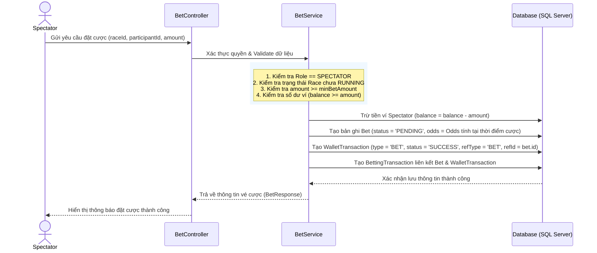
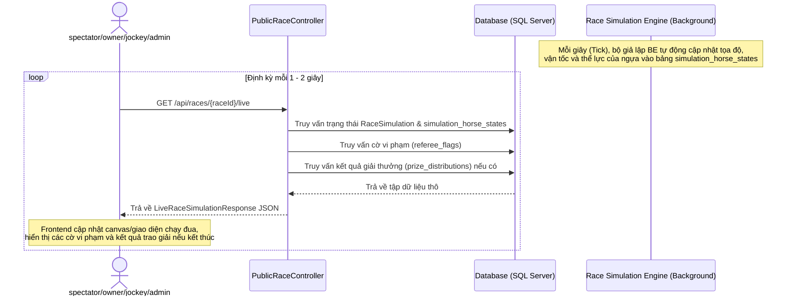

# ĐẶC TẢ LUỒNG ĐẶT CƯỢC SPECTATOR & XEM LIVE ĐUA CHO CÁC ROLE

Tài liệu này đặc tả chi tiết luồng nghiệp vụ, quy tắc hệ thống, thiết kế cơ sở dữ liệu và đặc tả API dành cho hai tính năng:
1. **Luồng Đặt cược của Spectator (Người xem)**.
2. **Luồng Xem Live Đua dành cho mọi Role (Spectator, Owner, Jockey, Admin)** - hạn chế quyền thao tác, chỉ cho phép xem diễn biến và kết quả.

---

## PHẦN 1: LUỒNG ĐẶT CƯỢC CỦA SPECTATOR (SPECTATOR BETTING FLOW)

### 1. Quy tắc & Ràng buộc Đặt cược
* **Đối tượng tham gia**: Chỉ người dùng có vai trò `SPECTATOR` mới được phép đặt cược. Các vai trò khác như `HORSE_OWNER`, `JOCKEY`, `RACE_REFEREE` bị cấm đặt cược để đảm bảo tính minh bạch.
* **Thời gian mở cược**: Cổng đặt cược mở ngay khi danh sách thi đấu chính thức được công bố (Trạng thái cuộc đua là `OPEN_FOR_REGISTER` hoặc `CLOSED_FOR_REGISTER`).
* **Thời gian đóng cược**: Cổng cược tự động đóng hoàn toàn khi cuộc đua chính thức bắt đầu (Trạng thái chuyển sang `RUNNING`). Mọi yêu cầu đặt cược sau thời điểm này đều bị từ chối.
* **Mức cược tối thiểu (Min Bet)**: Số tiền đặt cược cho mỗi vé phải lớn hơn hoặc bằng mức cược tối thiểu (`minBetAmount`) được cấu hình trong Giải đấu (`Tournament`) tương ứng.
* **Ràng buộc số dư**: Số tiền đặt cược không được vượt quá số dư ví hiện tại của người dùng (`Wallet.balance`). Số dư ví của spectator sẽ bị trừ ngay lập tức khi đặt cược thành công.

### 1.1. Các Loại Đặt Cược Đề Xuất (Bet Types)
Hệ thống hỗ trợ 3 loại đặt cược phổ biến trong đua ngựa để tăng tính đa dạng:
1. **Win Bet (Cược Thắng / Vô Địch)** (Hiện tại đã có):
   - **Mô tả**: Người xem chọn chú ngựa sẽ cán đích ở vị trí **Hạng 1** (Winner).
   - **Tỷ lệ cược (Odds)**: Tính động theo công thức ở Mục 2.
2. **Place Bet (Cược Vị Trí / Top 2)** (Đề xuất):
   - **Mô tả**: Người xem chọn chú ngựa sẽ cán đích ở vị trí **Hạng 1 hoặc Hạng 2**.
   - **Tỷ lệ cược (Odds)**: Thấp hơn cược Win (do xác suất trúng cao hơn).
3. **Show Bet (Cược Top 3)** (Đề xuất):
   - **Mô tả**: Người xem chọn chú ngựa sẽ cán đích ở một trong các vị trí **Hạng 1, Hạng 2 hoặc Hạng 3**.
   - **Tỷ lệ cược (Odds)**: Thấp nhất trong 3 loại (do xác suất trúng cao nhất).

> [!NOTE]
> **Lưu ý thiết kế Cơ sở dữ liệu (DB)**: Đối với các loại cược kết hợp nhiều ngựa như `Quinella` và `Exacta` (nếu triển khai sau này), bảng `bets` hiện tại (chỉ có cột `participant_id` đơn lẻ) cần được điều chỉnh (ví dụ: bổ sung thêm cột `participant_id_2`, hoặc chuyển sang mô hình 1-N với bảng chi tiết `bet_selections` liên kết nhiều `participant_id` vào một vé cược).

---

### 2. Công thức Tính toán Tỷ lệ Cược theo Mô hình Chia Quỹ (Pari-Mutuel)
Trong mô hình này, tỷ lệ cược (Odds) không được chốt cứng cố định trước trận mà sẽ biến động liên tục theo số lượng người cược và chỉ được chốt chính thức sau khi cuộc đua kết thúc dựa trên tổng quỹ tiền cược gom được. Quy trình tính toán gồm các bước sau:

#### BƯỚC 1: Thu thập tổng quỹ cược (Pools) của từng loại cược
Tất cả tiền đặt cược được gom vào 3 quỹ riêng biệt tùy theo loại cược:
* `total_win_pool`: Tổng tiền cược cửa Win (Thắng).
* `total_place_pool`: Tổng tiền cược cửa Place (Top 2).
* `total_show_pool`: Tổng tiền cược cửa Show (Top 3).

Hệ thống giữ lại 10% làm phí nhà cái (House Edge = 10%), quỹ chia thưởng thực tế (Net Pool) còn lại 90% (hệ số hoàn thưởng là 0.9):
* `net_win_pool = total_win_pool * 0.9`
* `net_place_pool = total_place_pool * 0.9`
* `net_show_pool = total_show_pool * 0.9`

#### BƯỚC 2: Tính tỷ lệ cược (Odds) chính thức khi kết thúc cuộc đua
Các chú ngựa đạt thứ hạng thắng cược sẽ được chia quỹ thưởng tương ứng:

1. **Win Bet (Cược Thắng - Hạng 1)**:
   - Toàn bộ `net_win_pool` được chia cho những người cược vào chú ngựa về **Hạng 1**.
   - Công thức tính Odds của chú ngựa về Hạng 1:
     `Odds_Win = net_win_pool / Tổng_tiền_cược_Win_của_ngựa_Hạng_1`
     *(Giới hạn sàn tối thiểu là 1.05)*

2. **Place Bet (Cược Vị Trí - Hạng 1 hoặc 2)**:
   - Quỹ `net_place_pool` được chia đôi làm 2 phần bằng nhau cho những người cược ngựa về **Hạng 1** và **Hạng 2**.
   - Odds cho ngựa về Hạng 1:
     `Odds_Place_H1 = (net_place_pool / 2) / Tổng_tiền_cược_Place_của_ngựa_Hạng_1`
   - Odds cho ngựa về Hạng 2:
     `Odds_Place_H2 = (net_place_pool / 2) / Tổng_tiền_cược_Place_của_ngựa_Hạng_2`
     *(Giới hạn sàn tối thiểu là 1.05)*

3. **Show Bet (Cược Top 3 - Hạng 1, 2 hoặc 3)**:
   - Quỹ `net_show_pool` được chia ba làm 3 phần bằng nhau cho những người cược ngựa về **Hạng 1**, **Hạng 2** và **Hạng 3**.
   - Odds cho ngựa về Hạng i (i = 1, 2, 3):
     `Odds_Show_Hi = (net_show_pool / 3) / Tổng_tiền_cược_Show_của_ngựa_Hạng_i`
     *(Giới hạn sàn tối thiểu là 1.05)*

*(Giá trị odds được làm tròn 2 chữ số thập phân)*

---

#### VÍ DỤ SỐ MINH HỌA THỰC TẾ
Giả sử cuộc đua có 3 chú ngựa tham gia là **A, B, C**. Tổng tiền đặt cược thu được là **100 triệu VNĐ**:
* **Win Bet (Cược Thắng)**: Tổng cộng **40 triệu VNĐ**. Trong đó:
  - Đặt vào ngựa A: 25 triệu VNĐ.
  - Đặt vào ngựa B: 10 triệu VNĐ.
  - Đặt vào ngựa C: 5 triệu VNĐ.
* **Place Bet (Cược Top 2)**: Tổng cộng **60 triệu VNĐ**. Trong đó:
  - Đặt vào ngựa A: 35 triệu VNĐ.
  - Đặt vào ngựa B: 20 triệu VNĐ.
  - Đặt vào ngựa C: 5 triệu VNĐ.

Kết quả cuộc đua: **Ngựa B về Nhất (Hạng 1), Ngựa A về Nhì (Hạng 2), Ngựa C về Ba (Hạng 3)**.

* **Tính toán Odds và trả thưởng**:
  - **Win Bet (Cược Thắng)**: Ngựa B thắng.
    - Quỹ chia thưởng thực tế: `net_win_pool = 40 triệu * 0.9 = 36 triệu VNĐ`.
    - Odds của ngựa B: `Odds_Win_B = 36 triệu / 10 triệu = 3.60`
    - (Người cược ngựa B ăn tỷ lệ 3.60. Đặt 100k ăn 360k. Người cược ngựa A, C thua cược).
  - **Place Bet (Cược Top 2)**: Ngựa B (Hạng 1) và Ngựa A (Hạng 2) thắng.
    - Quỹ chia thưởng thực tế: `net_place_pool = 60 triệu * 0.9 = 54 triệu VNĐ`.
    - Chia đôi quỹ thưởng: Mỗi bên nhận `54 triệu / 2 = 27 triệu VNĐ`.
    - Odds của ngựa B (Hạng 1): `Odds_Place_B = 27 triệu / 20 triệu = 1.35` (Đặt 100k ăn 135k).
    - Odds của ngựa A (Hạng 2): `Odds_Place_A = 27 triệu / 35 triệu = 0.77` => Nhỏ hơn 1.05 nên lấy sàn `1.05` (Đặt 100k ăn 105k).
    - (Người cược ngựa C thua cược).

---

### 3. Quy trình Xử lý Nghiệp vụ & Giao dịch (Database & Wallet Flow)

---

### 4. Luồng Nghiệp vụ Phát sinh: Hoàn tiền & Trả thưởng

#### A. Trường hợp Hoàn tiền cược (Refund)
Hệ thống sẽ hoàn trả 100% số tiền đặt cược ban đầu vào ví của Spectator và gửi thông báo trong các trường hợp sau:
1. **Trận đấu bị Hủy bỏ (`CANCELLED`)**: Trọng tài hoặc hệ thống hủy trận đấu trước hoặc trong khi diễn ra.
2. **Ngựa không đạt kiểm tra trước trận (`REJECTED`)**: Trọng tài từ chối cho ngựa tham gia do không đạt cân nặng, sức khỏe, v.v.
3. **Cặp đua bị loại trước trận (`DISQUALIFIED` trước khi chạy)**: Bị loại do vi phạm quy chế trước khi cuộc đua bắt đầu.

*Hành động của hệ thống*:
* Cập nhật trạng thái vé cược `Bet.status = 'REFUNDED'`.
* Cộng tiền lại vào ví của Spectator: `Wallet.balance = Wallet.balance + Bet.amount`.
* Lưu giao dịch ví `WalletTransaction` (loại `REFUND`, trạng thái `SUCCESS`).

#### B. Trường hợp Kết thúc và Trả thưởng (Confirm Results & Payout)
Khi trọng tài xác nhận kết quả chính thức của trận đấu, hệ thống duyệt qua tất cả vé cược có trạng thái `PENDING` và cập nhật:

1. **Thu thập thông tin tiền cược & kết quả thực tế để tính toán Odds**:
   - Xác định tổng tiền cược của các quỹ: `total_win_pool`, `total_place_pool`, `total_show_pool` của cuộc đua đó.
   - Xác định tổng tiền đặt cược của các vé thắng (ví dụ: tổng tiền cược Win vào con ngựa Hạng 1, tổng tiền cược Place vào con ngựa Hạng 1, Hạng 2, v.v.).
   - Tính toán ra tỷ lệ Odds thực tế (`Odds_Win`, `Odds_Place` cho từng con ngựa về đích Top 2, `Odds_Show` cho từng con ngựa về đích Top 3) dựa trên các công thức Chia Quỹ ở Mục 2.

2. **Xác định kết quả thắng/thua theo loại đặt cược (`bet_type`)**:
   - **Với Win Bet (Cược Thắng)**: 
     - **Thắng (`WON`)**: Nếu ngựa đặt cược đạt `finalRank == 1`. 
     - **Thua (`LOST`)**: Nếu ngựa đạt `finalRank > 1`.
   - **Với Place Bet (Cược Vị Trí / Top 2)**: 
     - **Thắng (`WON`)**: Nếu ngựa đặt cược đạt `finalRank <= 2`.
     - **Thua (`LOST`)**: Nếu ngựa đạt `finalRank > 2`.
   - **Với Show Bet (Cược Top 3)**: 
     - **Thắng (`WON`)**: Nếu ngựa đặt cược đạt `finalRank <= 3`.
     - **Thua (`LOST`)**: Nếu ngựa đạt `finalRank > 3`.

3. **Quy tắc Trả thưởng & Cập nhật ví**:
   - **Nếu vé cược Thắng (`WON`)**:
     - Cập nhật tỷ lệ cược thực tế của vé cược đó: `Bet.odds` = Tỷ lệ Odds tính theo Chia Quỹ (chứ không dùng Odds dự kiến ban đầu).
     - Tính toán tiền thưởng: `payoutAmount = Bet.amount * Bet.odds`.
     - Cộng tiền thưởng vào ví Spectator: `Wallet.balance = Wallet.balance + payoutAmount`.
     - Lưu giao dịch ví `WalletTransaction` (loại `PRIZE`, trạng thái `SUCCESS`, refId = `bet.id`).
     - Gửi thông báo chúc mừng thắng cược cho Spectator.
   - **Nếu vé cược Thua (`LOST`)**:
     - Tiền thưởng nhận được `payoutAmount = 0`.
     - Không hoàn lại tiền cược gốc (do đã trừ từ lúc đặt cược).
     - Gửi thông báo kết quả đặt cược.

---
---

## PHẦN 2: LUỒNG XEM LIVE ĐUA TRÊN TRANG CỦA CÁC ROLE (PUBLIC LIVE VIEW FLOW)

### 1. Phân quyền và Bảo mật (Authorization & Access Control)
* **Quyền kiểm soát (Write Operations)**: Chỉ duy nhất Trọng tài (`RACE_REFEREE`) được phân công quản lý cuộc đua mới có quyền gọi các API thay đổi trạng thái cuộc đua:
  * Bắt đầu cuộc đua (`POST /api/referee/races/{id}/start`).
  * Gắn cờ vi phạm (`POST /api/referee/races/{id}/flags`).
  * Xác nhận kết quả (`POST /api/referee/races/{id}/confirm-results`).
  * Hủy cuộc đua (`POST /api/referee/races/{id}/cancel`).
  * *Tất cả các role khác (Spectator, Owner, Jockey, Admin) gọi vào các endpoint này sẽ nhận phản hồi `403 Forbidden`.*
* **Quyền xem (Read-only Operation)**: Mọi role đăng nhập vào hệ thống (hoặc thậm chí khách truy cập công cộng - Public) đều có quyền gọi API lấy dữ liệu mô phỏng trực tiếp để cập nhật giao diện thời gian thực.

---

### 2. Mô hình Hoạt động Xem Live đua (Polling Mechanism)

